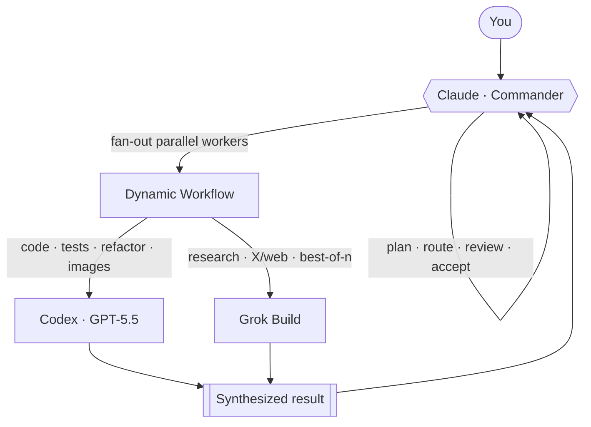

<p align="center">
  
</p>

<h1 align="center">Claude Multiengine Router</h1>

<p align="center"><strong>指挥，而非哄劝。&nbsp;·&nbsp;Command. Don't coax.</strong></p>

<p align="center">
Claude is the commander. Through dynamic workflows it fans out a mixed elite team of <b>Codex (GPT-5.5)</b> and <b>official Grok Build</b> — every task routed to the engine that does it best.
</p>

<p align="center">
  <a href="#-quick-start">Quick Start</a> ·
  <a href="#-how-it-works">How It Works</a> ·
  <a href="#-engines">Engines</a> ·
  <a href="#%EF%B8%8F-safety">Safety</a> ·
  <a href="#中文说明">中文</a>
</p>

<p align="center">
  
  
  
</p>

---

## Why this exists

Claude's real superpower isn't writing one file — it's **integrating tasks, managing concurrency, and running a high-throughput team**: dynamic workflows that fan out dozens of subagents in parallel. But heavy fan-out burns a single provider's quota fast.

So this project plugs **Codex (GPT-5.5)** and **official Grok Build** into that team as first-class workers — not to replace Claude, but to:

- **Extend your quota / compute** — heavy parallel fan-out without burning a single provider's limit.
- **Leverage each engine's strength** — Codex for code, Grok for research & real-time X signals, Claude for orchestration.
- **Pool your separate subscriptions** into one mixed team, each playing to its strength.

> Claude commands; Codex and Grok are the elite worker bees.

## 🎬 Demo

<!-- TODO: 15–30s terminal GIF (<5MB) — Claude receives a task, fans out a dynamic workflow, Codex + Grok workers run in parallel, results synthesized. -->
<p align="center"><em>(demo recording coming soon — drop a terminal GIF here, &lt;5MB)</em></p>

## 🐝 How It Works



Claude stays the **commander** — planning, routing, concurrency, review, final acceptance. Codex and Grok are exposed **two ways**, which compose:

- **MCP tools** — `mcp__codex__codex`, `mcp__grok__grok_research`, `mcp__grok__grok_code` (mechanism-level, called natively).
- **Proxy subagents** — fanned out in parallel inside a dynamic workflow (`--ephemeral`, so many Codex runs never collide).

The routing decision ("who does this task best?") stays Claude's judgment; capability metadata lives in each tool's description, not in a global prompt.

## 🧩 Engines

<p align="center">
  
</p>

| Engine | Role | Strengths |
|--------|------|-----------|
| **Claude** *(you're here)* | Commander | Task integration, concurrency, fan-out orchestration, review & acceptance |
| **Codex** (GPT-5.5) | Code & images | Highest code quality, generous quota, built-in image generation |
| **Grok Build** | Research & fallback | Real-time web + X signals, `best-of-n` coding comparison |

Installed proxy agents: `codex-exec` · `codex-fast` · `codex-image` · `codex-review` · `grok-research` · `grok-coder`.

## 🛡️ Safety

> [!WARNING]
> **Full-permission setup.** This installs Codex with `danger-full-access` — it can access the network and read/write arbitrary local paths. Install only if you understand and accept that. Do **not** delegate destructive operations, secrets, production access, migrations, or unique-data work without explicit confirmation and backups.

## 🚀 Quick Start

Phase 2 supports **macOS, Linux, and Windows**. The install logic lives in `install.py`; `install.sh` and `install.ps1` are thin wrappers.

### 1. Install & authenticate prerequisites

- Claude Code — https://code.claude.com/docs/en/setup
- Codex CLI — https://developers.openai.com/codex/cli
- Grok Build — https://docs.x.ai/build/overview
- Python 3 — https://www.python.org/downloads/

Then log in manually (the installer checks `codex login status` and `grok models`, but never logs in for you):

```bash
codex login
grok login
```

### 2. One-command install

**macOS / Linux:**

```bash
git clone https://github.com/<you>/claude-multiengine-router.git
cd claude-multiengine-router
bash install.sh
```

**Windows PowerShell:**

```powershell
git clone https://github.com/<you>/claude-multiengine-router.git
cd claude-multiengine-router
.\install.ps1
```

If PowerShell blocks local scripts, allow locally created scripts for the current user, then retry — or run the Python installer directly:

```powershell
Set-ExecutionPolicy -Scope CurrentUser RemoteSigned
.\install.ps1
# or
python .\install.py
```

### 3. Optional configuration

```bash
cp config.example.sh config.local.sh
$EDITOR config.local.sh
bash install.sh
```

| Value | Default | Meaning |
|-------|---------|---------|
| `OUTPUT_DIR` | `~/.agent-router/output` | where generated assets land |
| `ENABLE_WIKI_LOG` | `false` | personal wiki-logging hook (off for open source) |
| `CODEX_MODEL` | *(empty)* | empty = use Codex config |
| `GROK_MODEL` | `grok-build` | default Grok model |

Advanced path overrides: `CLAUDE_BIN`, `CODEX_BIN`, `GROK_BIN`, `PYTHON_BIN`.

## What Gets Installed

```text
~/.claude/
├── skills/agent-router/SKILL.md
├── agents/{codex-exec,codex-fast,codex-image,codex-review,grok-research,grok-coder}.md
├── mcp-servers/grok-mcp/{server.py, requirements.txt, .venv/}
└── agent-router/{config.sh, config.ps1}
```

The installer also registers two user-scoped MCP servers:

```bash
claude mcp add -s user codex -- <codex> mcp-server
claude mcp add -s user grok  -- <venv-python> <server.py>
```

Existing same-name skills/agents/MCP files are backed up before replacement (unless this project installed them).

## Usage

Restart Claude Code after installation, then ask Claude to use the `agent-router` skill for multi-engine delegation:

```text
Use agent-router. Have Codex implement the failing test, then review the diff.
```

```text
Use agent-router. Ask Grok to research current community discussion, then decide whether Codex should ship a patch.
```

## Uninstall

```bash
bash uninstall.sh      # macOS/Linux
.\uninstall.ps1        # Windows
```

Same-name installed files are backed up under `~/.claude/backups/claude-multiengine-router-uninstall-<timestamp>/`, and the user-scoped `codex` / `grok` MCP registrations are removed when the `claude` CLI is available.

## Development Checks

```bash
bash -n install.sh uninstall.sh tests/test_install_temp_home.sh tests/test_uninstall_temp_home.sh
bash tests/test_install_temp_home.sh
bash tests/test_uninstall_temp_home.sh
python3 tests/test_python_installer.py
python3 -m unittest discover -s mcp-servers/grok-mcp -p 'test_*.py'
```

The temp-HOME smoke tests use fake `claude`/`codex`/`grok` binaries — they never touch your real `~/.claude`.

## License

[MIT](LICENSE)

---

## 中文说明

<p align="center"><strong>指挥，而非哄劝。</strong></p>

Claude 真正的超能力不是写一个文件，而是**整合任务、并发管理、高效率团队开发**——用动态工作流一次铺开几十个子代理并行干。但大规模 fan-out 会很快烧爆单一厂商的额度。

所以本项目把 **Codex(GPT-5.5)** 和**官方 Grok Build** 作为一等公民编进这支团队，不是替代 Claude，而是：

- **补充额度/算力** —— 大并发 fan-out 不烧爆任何单一厂商限额；
- **发挥各家专长** —— 写码用 Codex，调研和 X 实时信号用 Grok，编排调度用 Claude；
- **把分散的多家订阅池化**成一支混编精英团队，各展所长。

> Claude 指挥，Codex 和 Grok 是精英工蜂。

### 核心分工

| 引擎 | 角色 | 长处 |
|------|------|------|
| **Claude** | 指挥官 | 任务整合、并发管理、fan-out 编排、审查验收 |
| **Codex** (GPT-5.5) | 写码与生图 | 写码质量最高、额度慷慨、内置生图 |
| **Grok Build** | 调研与备选 | 实时 web + X 信号、best-of-n 写码对比 |

> [!WARNING]
> **全权限配置。** 本套配置让 Codex 使用 `danger-full-access`——它可以联网、读写任意本机路径。安装前必须知情同意；涉及删除、迁移、密钥、生产环境、数据库或唯一数据时，必须先确认范围、备份和回滚方案。

### 安装

先自己登录（安装器只检查登录状态，不替你登录）：

```bash
codex login
grok login
```

安装（macOS/Linux 用 `bash install.sh`，Windows 用 `.\install.ps1` 或 `python .\install.py`）：

```bash
git clone https://github.com/<you>/claude-multiengine-router.git
cd claude-multiengine-router
bash install.sh
```

可选配置见 `config.example.sh`：默认输出目录 `~/.agent-router/output`，wiki 落档提醒默认关闭。

### 卸载

```bash
bash uninstall.sh      # macOS/Linux
.\uninstall.ps1        # Windows
```

安装时的同名文件会先备份到 `~/.claude/backups/`，并移除用户级 `codex` / `grok` MCP 注册。
